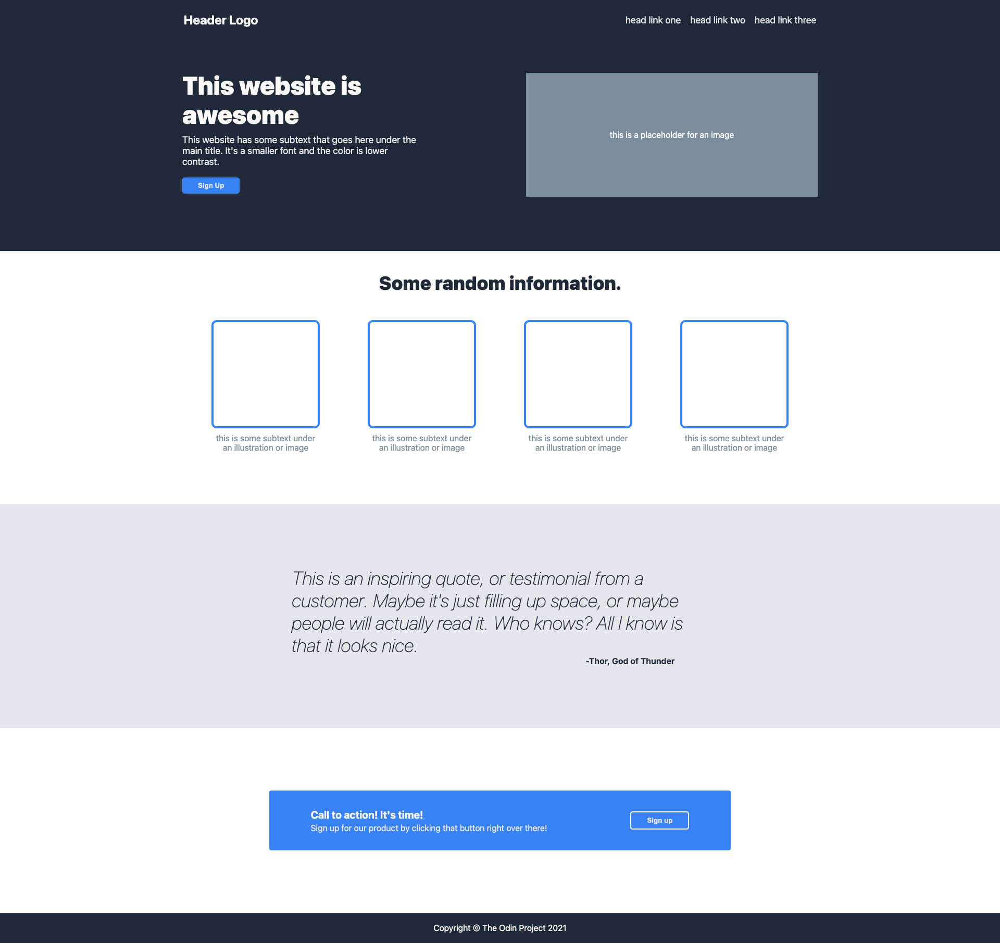

# Landing Page Mockup

## Context

This project aims to showcase my proficiency in developing a landing page mockup from a design, utilizing HTML and CSS to create a visually appealing and functional web interface.

## Tools Used

### HTML:

- Fundamental tags:
    - `<a>`
    - `<h3>`
    - `<ul>`
    - `<li>`
    - `
`
    - `<button>`

### CSS:

- Basic styling:
    - margin
    - padding
    - font properties
    - color properties

- Layout: Flexbox

## Final End Product

Below is the final mockup of the landing page created using the aforementioned HTML and CSS elements:

